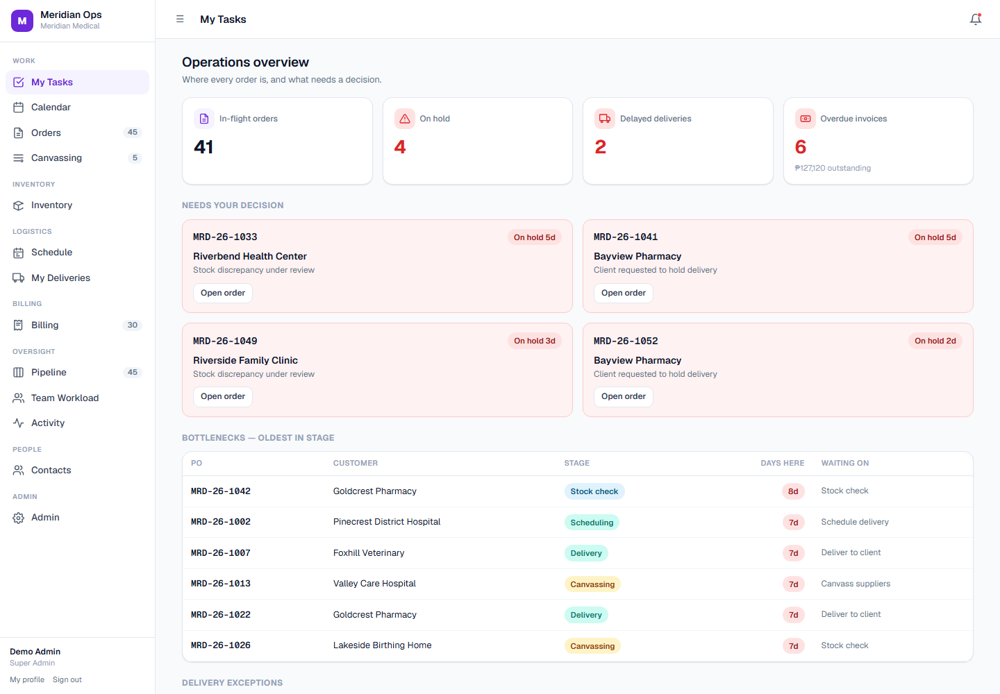
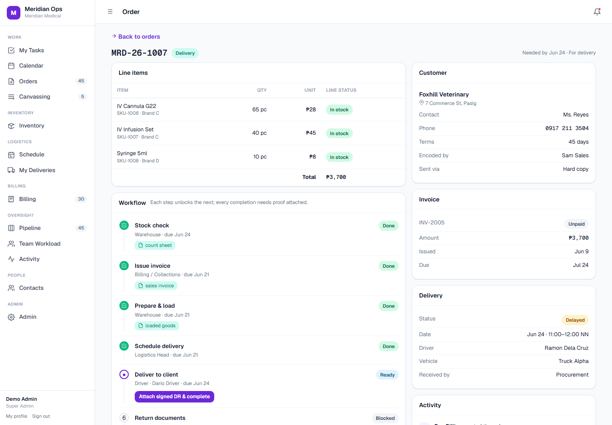
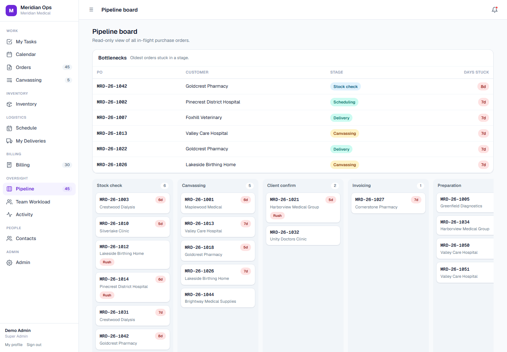
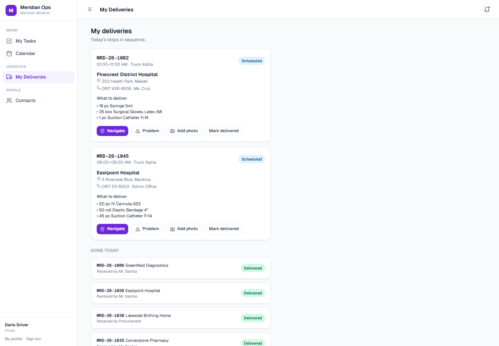

# Meridian Ops — Operations App (Standalone Demo)

A purchase-order **operations app** for a medical-supply distributor: every order moves
through a gated, task-by-task workflow where each step is owned by a department and nothing
can be skipped. This repository is a **single self-contained HTML demo** of that app, running
entirely in the browser on synthetic data.

> **There is a real, working version.** The production app is built with **Next.js + Supabase
> + Vercel** — Postgres with row-level security, realtime updates, Google sign-in, and email
> notifications. That codebase is private. **What you see here is a standalone HTML demo** that
> recreates the same screens and flows with **mock, anonymized data** so it can be explored
> without a backend, login, or deployment.

> **Synthetic data only.** "Meridian Medical Supply Co." is a fictional company; every
> customer, order, price, and staff name here is made up.

**▶ Live demo:** https://riegodavid-git.github.io/meridian-ops/
&nbsp;·&nbsp; click any demo account (password: `password`).

---

## What the app does

A distributor was running its purchasing out of one shared spreadsheet that ~30 people edited
at once — no ownership, no workflow, frequent data loss. This app replaces that with a system
where every purchase order is a small **dependency graph of tasks** (blocked → ready → done),
each owned by the right role, with proof required at every step.

### Highlights

- **Task-DAG workflow.** Each PO runs a fixed pipeline — *encode → stock check → canvassing →
  client confirmation → invoicing → prepare & load → schedule → deliver → return docs → collect
  → completed*. Completing a task unlocks the next and notifies its owner; conditional steps
  (canvassing, client confirmation) only appear when there's a shortage.
- **Role-based access (9 roles).** Sign in as any role and the sidebar, pages, and actions
  change. A driver sees only *My Deliveries*; warehouse sees stock but not prices; billing owns
  invoices and collections; management gets the read-only oversight view.
- **Live permission matrix.** The Admin page exposes a roles × permissions grid — toggle a
  permission and the current user's navigation updates immediately.
- **Two dashboards.** Staff get a personal **"My Tasks"** feed (ready for you / waiting on
  others / recently done); management gets an **Operations overview** (in-flight, on-hold,
  delayed deliveries, overdue invoices, bottlenecks, exceptions).
- **Inventory ledger.** Stock on hand by location, low-stock flags, reorder points.
- **Canvassing.** Side-by-side supplier quotes for shortage lines, with the best price flagged.
- **Billing & collections.** To-invoice queue, open invoices, collections aging buckets,
  overdue alerts, paid-recently.
- **Schedule & fleet.** Preparation queue plus a timeslot × vehicle day board; delay exceptions.
- **Driver view.** A phone-style stop list with navigate / report-problem / add-photo /
  mark-delivered, gated on uploading the signed DR first.
- **Activity, workload, calendar, contacts** — audit trail, team task load, a combined
  delivery/task/meeting calendar, and a customer + staff directory.

## Demo accounts

Every password is `password`. Each role lands on its own home screen.

| Username | Role | Sees |
|---|---|---|
| `admin` | Super Admin | Everything + the permission matrix |
| `manager` | Management | Operations overview + all dashboards (read-only) |
| `sales` | Sales / Encoder | Encode POs, confirm with clients |
| `warehouse` | Warehouse | Stock checks, prepare & load, inventory (no prices) |
| `purchasing` | Purchasing | Canvassing and supplier receivings |
| `logistics` | Logistics Head | Schedule deliveries, fleet, exceptions |
| `driver` | Driver | Phone view of own deliveries only |
| `billing` | Billing / Collections | Invoices, payments, document returns |
| `newuser` | Viewer | Nothing yet — admin must assign a role |

## Screens

| Order detail (task DAG) | Pipeline board | Driver view |
|---|---|---|
|  |  |  |

## Tech

| | Demo (this repo) | Production app (private) |
|---|---|---|
| Frontend | Single-file **vanilla JS + HTML + CSS** | **Next.js 16** (App Router), **React**, **TypeScript** |
| Styling | Hand-written CSS, Geist font | **Tailwind CSS 4**, same design tokens |
| Data | In-memory synthetic seed (deterministic) | **Supabase / Postgres** with **row-level security** |
| Auth | Pick-a-role demo login | Supabase Auth + **Google sign-in** |
| Realtime / email | — | Supabase Realtime + **Resend** notifications |
| Hosting | GitHub Pages (static) | **Vercel** |

The demo intentionally has **no backend and no dependencies** — open `index.html` and it runs.
The production app enforces the same permissions at the database level (RLS), so reads and
writes are safe even though the demo simulates them client-side.

---

_Standalone demo of a real Next.js + Supabase operations app. Synthetic data only._
